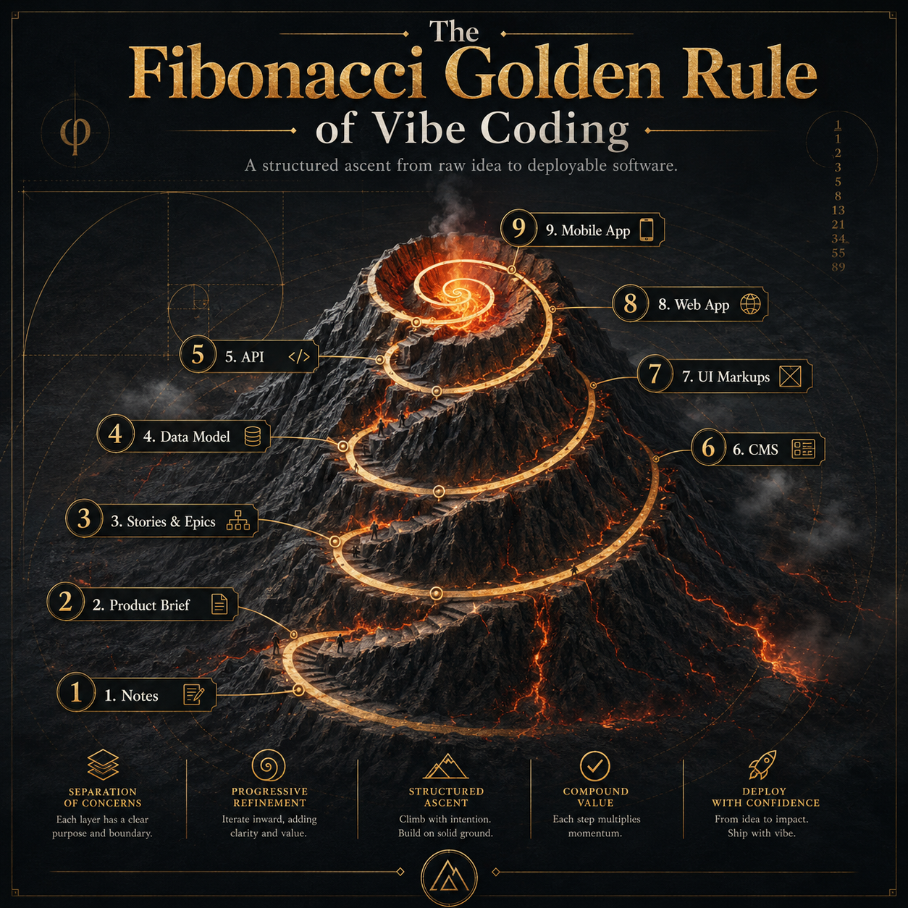

# Pitch. Build. Today.

**Pitch. Build. Today.** is a repo-based workflow for turning incomplete vibe-coding prompts into build-ready app artifacts.

Vibe coding can move fast. It also breaks fast when the idea skips product definition, backlog structure, data modeling, API planning, CMS logic, and UI clarity.

This repo solves that by forcing each stage to produce a usable handoff before the next stage begins.

> No step should make the next step guess.

## The Problem

Most incomplete AI-built apps start with incomplete input.

A prompt like “build me an app for this idea” usually does not define the actors, verbs, nouns, dependencies, data states, admin needs, experience sequence, or deployment requirements.

That creates fragile demos instead of durable software.

## The Workflow

|  # | Step                                                         | Output        | Format                                  |
| -: | ------------------------------------------------------------ | ------------- | --------------------------------------- |
| 00 | [Problem to Ideas](./00_problem_to_ideas.md)                 | Ideas         | `.txt`, `.csv`, `.pdf`, `.html`, `.doc` |
| 01 | [Ideas to Product Brief](./01_ideas_to_product_brief.md)     | Product Brief | `.pdf`                                  |
| 02 | [Product Brief to Backlog](./02_product_brief_to_backlog.md) | Backlog       | `.csv`                                  |
| 03 | [Backlog to Data Model](./03_backlog_to_data_model.md)       | Data Model    | `.yaml`                                 |
| 04 | [Data Model to API](./04_data_model_to_api.md)               | API           | `.php`                                  |
| 05 | [API to CMS](./05_api_to_cms.md)                             | CMS           | `.tsx`                                  |
| 06 | [CMS to UI Mockups](./06_cms_to_ui_mockups.md)               | UI Mockups    | `.figma`                                |
| 07 | [UI Mockups to Web App](./07_ui_mockups_to_web_app.md)       | Web App       | `.tsx`                                  |
| 08 | [Web App to Mobile App](./08_web_app_to_mobile_app.md)       | Mobile App    | `.ipa`, `.apk`                          |

Each step `.MD` explains the input, transformation, output, gate, and link to that step's agent `.MD`.

## The Rule

Do not ask code to solve what the blueprint failed to define.

🌋
